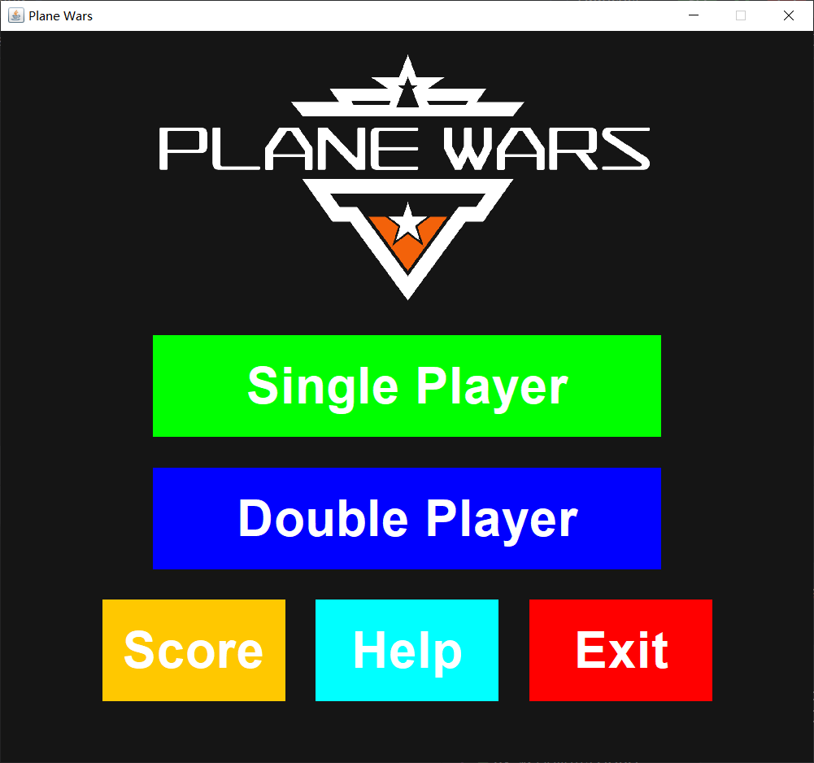
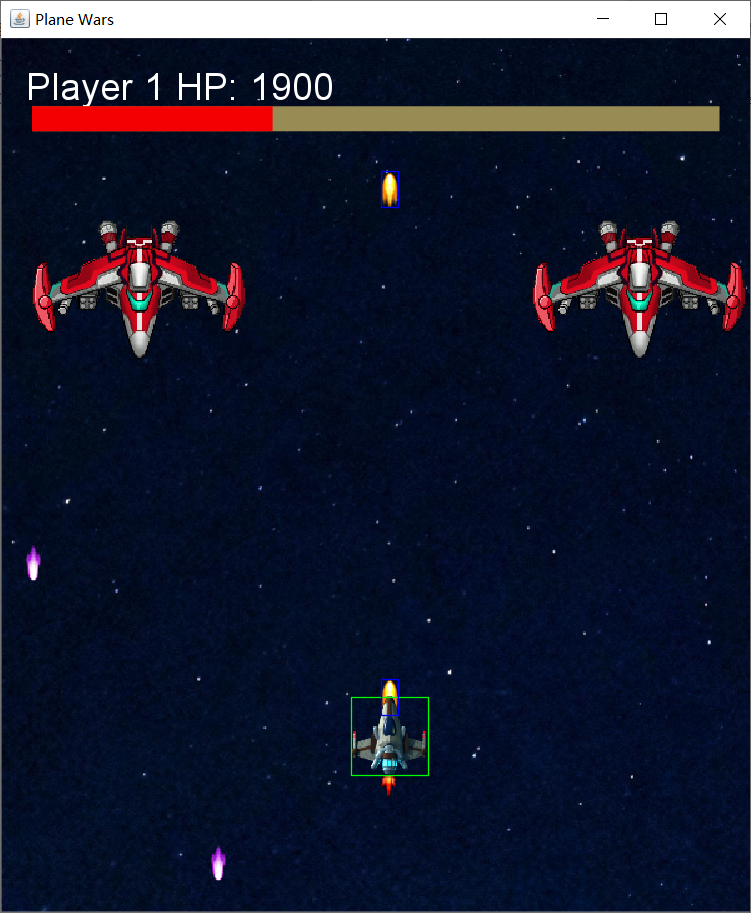
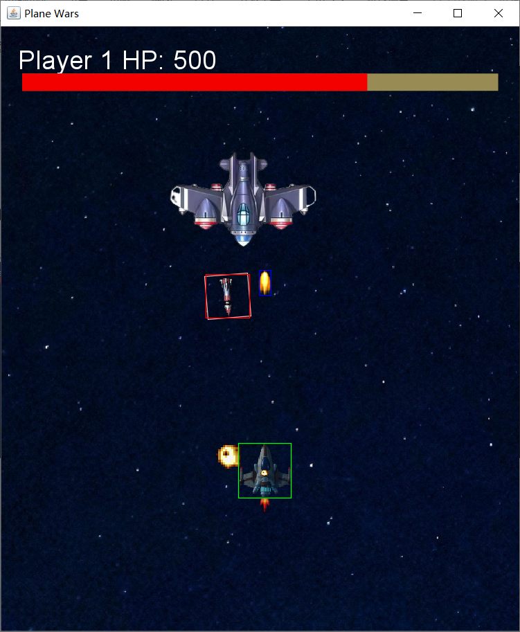

# Plane Wars Game

## Introduction

Plane Wars is a 2D shooting game where players control a fighter jet, navigating through a starry sky, battling waves of enemies, and dodging bullets. The game offers both single-player and two-player modes, each providing a unique challenge with increasing levels of difficulty.

## Features
- **Game Mechanics:** Use the keyboard to control the fighter jet, shoot enemies, avoid collisions, and dodge bullets.

- **Level Design:** Single-player and two-player modes with three types of ordinary enemies and three elite bosses. Each enemy type varies in health, size, and attack patterns.

- **Visual Design:** An endless starry sky background with dynamic aircraft movements and explosion animations.

- **User Interface:** Simple and intuitive main menu with options to start the game, view the scoreboard, access help, and exit. The game features a pause and failure screen.

- **Game Balance:** Tiered enemy difficulty, with tier 1 enemies defeated by one shot, tier 2 by two shots, and tier 3 by four shots. Elite bosses have higher health and special attacks. A reward system includes boosts like health increases, double bullets, missiles, and lasers.

## Gameplay

### Single Player Mode
- One player controls the fighter jet.

- The game ends when the player's health reaches 0.

### Two-player Mode
- Two players control separate fighter jets.

- The game ends when either player's health reaches 0.
  
### Items
- **1up:** Adds 200 HP, up to a maximum of 5000 HP.

- **Flame Shot:** Replaces normal ammunition with flame shots for 30 rounds.

- **Missiles:** Stores 10 missiles, fired using designated keys.

- **Laser:** Provides a temporary laser attack.

### Enemies

- **Aircraft Cluster:** Randomly generated, moving downwards.

- **Enemy Bosses:** Include the Trio (fires two types of ammunition), Green Fighter (uses diffuser bullets), and Dark Blue Fighter (uses tracking missiles).

### Installation
Clone the repository: 
```
git clone https://github.com/ImQQiaoO/PlaneWars.git
```

### Screenshots




### License
This project is licensed under the **AGPL-3.0 License**. See the LICENSE file for details.


### Declaration
- If you like this project, please give it a star. This is the greatest encouragement for us.
- Please comply with the open-source license.
- The Readme file is written by ChatGPT-4o. 

---

# 飞机大战

## 介绍
飞机大战是一款2D射击游戏，玩家控制战斗机在星空中穿梭，击败一波波敌人并躲避子弹。游戏提供单人和双人模式，每种模式都具有不断增加的难度挑战。

## 特点
- **游戏机制:** 使用键盘控制战斗机，射击敌人，避免碰撞，躲避子弹。

- **关卡设计:** 单人和双人模式，有三种普通敌人和三种精英Boss。每种敌人类型在健康值、大小和攻击模式上有所不同。

- **视觉设计:** 无限星空背景，动态的飞机移动和爆炸动画。

- **用户界面:** 简单直观的主菜单，提供开始游戏、查看记分板、访问帮助和退出选项。游戏具有暂停和失败界面。

- **游戏平衡:** 分级敌人难度，一级敌人一枪击败，二级敌人两枪，三级敌人四枪。精英Boss具有更高的健康值和特殊攻击。奖励系统包括增加健康值、双倍子弹、导弹和激光等增强功能。

## 游戏玩法

### 单人模式
- 一名玩家控制战斗机。
- 当玩家的健康值达到0时，游戏结束。

### 双人模式
- 两名玩家分别控制战斗机。
- 当任一玩家的健康值达到0时，游戏结束。

### 道具
- **1up:** 增加200 HP，最高可达5000 HP。

- **火焰射击:** 用火焰弹替换普通弹药，共30发。

- **导弹:** 存储10枚导弹，使用指定键发射。

- **激光:** 提供临时激光攻击。

### 敌人

- **飞机群:** 随机生成，从上方向下移动。

- **敌人Boss:** 包括三人组（发射两种弹药）、绿战斗机（使用散弹）和深蓝战斗机（使用追踪导弹）。

### 安装
克隆仓库: 
```
git clone https://github.com/ImQQiaoO/PlaneWars.git
```

### 截图


### 许可证
此项目根据**AGPL-3.0 License**许可证授权。详见LICENSE文件。


### 声明
- 如果你喜欢本项目，请为它点一个Star，这是对我们最大的鼓励。
- 请遵守开源协议。
- 本Readme文件由ChatGPT-4o编写。